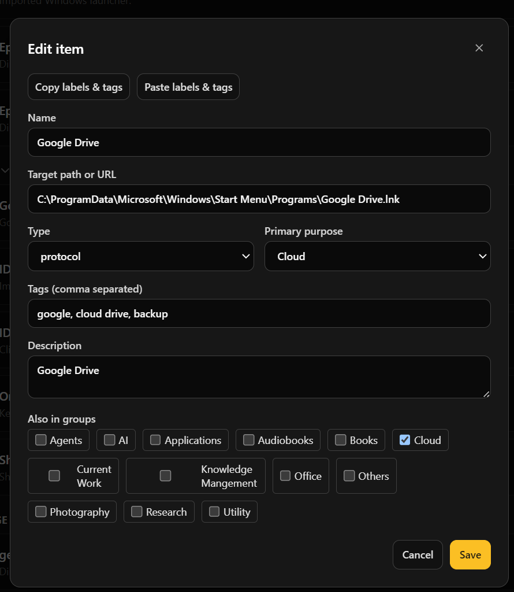

# App Launcher — Organise your Windows working environment

App Launcher is an offline-first Windows desktop library for applications, folders, files, URLs and named workspaces.

## Why App Launcher?

App Launcher provides a single, private desktop workspace for applications, folders, documents and web resources that would otherwise be scattered across the Windows Start menu, File Explorer, desktop shortcuts and browser bookmarks.

It is designed for project-based and research-intensive work. Resources can be organised by purpose, grouped into named workspaces, pinned for current tasks and reopened without moving or altering the original files. This reduces repeated searching and makes complex working environments easier to navigate.

The application works locally and offline. Its library, workspace structure and organisational data remain on the user’s computer rather than depending on an account, cloud service or external backend.

This desktop build loads its packaged interface directly through Electron. It contains no Express server, no localhost service and no external backend.

## Interface at a glance

### Workspace dashboard


Workspaces keep folders on the left and working files on the right, while the lower panels provide Favourites, a selected Focus group, and Recent items.

### Working folders and files


Add, verify, relink and remove working folders or files without changing the originals.

### Import and organisation

<table>
  <tr>
    <td></td>
    <td></td>
  </tr>
</table>

Scan a folder for local items, and show, hide, collapse or reorder dashboard panels.

### Item details



Each item can have a primary purpose, additional groups, and reusable tags.

## Run and package

```bash
npm install
npm run desktop:start
```

Create a Windows installer with:

```bash
npm run desktop:build
```

The installer is written to `dist-desktop/`.

## Downloading the Windows installer

Published desktop releases include a ready-to-install Windows `.exe` in the repository's **Releases** page. Download `App Launcher Setup <version>.exe`, close App Launcher if it is open, and run the downloaded installer. Node.js and the source project are not needed for this route.

## Installation and existing-library migration

This is the first public, self-contained desktop release. Download and install it directly; no earlier version is required.

If you previously used an internal or localhost-based pre-release and its library does not appear after installation, use the earlier migration repair build once, then reopen this desktop release.

## What this release changes

- Existing `localhost` launcher data is migrated once into a local v2 library file, with a browser-storage backup retained.
- Each item has a primary purpose and can belong to additional groups.
- Groups and tags are displayed alphabetically; the library supports flat, purpose and A–Z views.
- The dashboard panels can be collapsed, hidden and restored.
- Workspaces combine applications with actual folders, files, URLs and protocol links.
- Workspace-only folders and files can be added directly from the Workspaces panel without appearing in the general library.
- Groups and tags can be deleted or merged, and shortcut labels/tags can be copied and pasted through the edit dialog.
- Workspace filenames retain their extensions; selected shortcuts support bulk copying and pasting of labels and tags.
- First launch offers an optional folder scan; Workspaces support A–Z/type arrangement, file-type fallbacks, and a full-width two-column view when other dashboard panels are hidden.
- Workspace-only file type icons include selected vectors sourced from [SVG Repo](https://www.svgrepo.com/); see the in-app Credits entry and SVG Repo's individual asset licences.
- Workspace entries can be verified, relinked, or removed without touching the underlying file or folder.
- Workspaces takes the full dashboard width by default, supports vertical resizing, and grouped library sections support Collapse all / Expand all.
- Workspace-only Add folder and Add file support selecting multiple folders or files at once.
- Folder scanning uses actual local paths, and matching targets are not imported twice.
- The Electron bridge handles local opening, scanning, persistence and icon caching; the renderer does not have direct Node access.

## Development checks

```bash
npm run lint
npm run build
```
